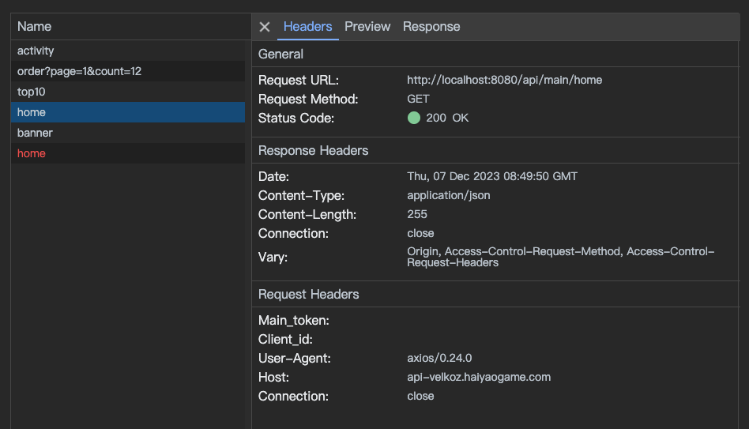

# next-axios-network

一款在开发时监控 next.js + axios 项目服务端请求的 Network 面板




## 什么是 next-axios-network

在使用 next.js 开发时，有时候会遇到服务端请求无法详细 debug 的烦恼，例如：

```js
// `pages` directory
export const getStaticProps = async () => {
  const data = await axios.get("https://example.com/api/home");
  return {
    props: {
      data,
    },
  };
};
// `app` directory
export default async function Dashboard() {
  const data = await axios.get("https://example.com/api/home");
  return (
    <ul>
      {data.map((item) => (
        <li key={item.id}>{item.name}</li>
      ))}
    </ul>
  );
}
```

这样的请求是在 node 环境进行的，无法通过浏览器 Network 面板进行监控，有了 next-axios-network 即可解决这个痛点

## 安装

```bash
npm i next-axios-network -D
```

## 使用

1. 在 `next.config.js` 加入配置：

```javascript
const NextAxiosNetworkPlugin = require("next-axios-network/plugin");

/** @type {import('next').NextConfig} */
const nextConfig = {
  webpack: (config) => {
    config.plugins.push(NextAxiosNetworkPlugin());
    return config;
  },
  // ...
};

module.exports = nextConfig;
```

2. 在封装 axios 的地方或者项目首次执行的文件加入 axios 拦截器配置：

```javascript
import axios from "axios";
import nextAxiosNetwork from "next-axios-network";
nextAxiosNetwork(axios);
```

如果使用了自定义 axios 实例，需要手动引入拦截器，例如：

```javascript
import axios from "axios";
import nextAxiosNetwork, { middlewares } from "next-axios-network";
nextAxiosNetwork(axios);
const yourAxiosInstance = axios.create({ /** ... */ });
yourAxiosInstance.instance.interceptors.request.use(
  middlewares.requestMiddleWare,
  middlewares.requestError
);
yourAxiosInstance.instance.interceptors.response.use(
  middlewares.responseMiddleWare,
  middlewares.responseError
);
```

完成上述配置，启动项目后访问：
```bash
http://localhost:2999
```
即可看到监控面板
