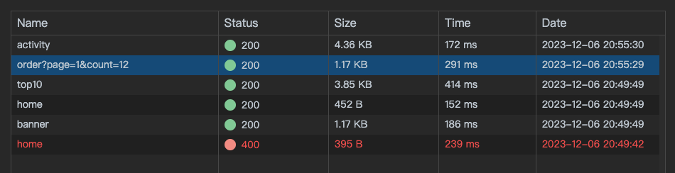
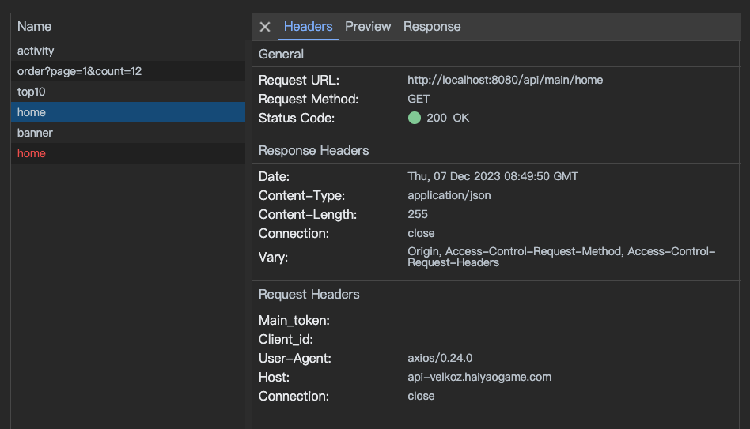

# next-axios-network

[中文](./README.md) ｜ [English](./README_EN.md)

A Network panel to monitor server-side requests for next.js + axios projects during development.




## What is next-axios-network

When developing with next.js, you sometimes run into the annoyance of not being able to debug a server-side request in detail, for example:

```js
// `pages` directory
export const getStaticProps = async () => {
  const data = await axios.get("https://example.com/api/home");
  return {
    props: {
      data,
    },
  };
};
// `app` directory
export default async function Dashboard() {
  const data = await axios.get("https://example.com/api/home");
  return (
    <ul>
      {data.map((item) => (
        <li key={item.id}>{item.name}</li>
      ))}
    </ul>
  );
}
```

Such requests are made in a node environment and cannot be monitored through the browser's Network panel, which is a pain point that can be solved with the next-axios-network

## Install

```bash
npm i next-axios-network -D
```

## Usage

1. Add configuration to `next.config.js`:

```javascript
const NextAxiosNetworkPlugin = require("next-axios-network/plugin");

/** @type {import('next').NextConfig} */
const nextConfig = {
  webpack: (config) => {
    config.plugins.push(NextAxiosNetworkPlugin());
    return config;
  },
  // ...
};

module.exports = nextConfig;
```

2. Add the axios interceptor configuration where axios is wrapped or in the file where the project is first executed:

```javascript
import axios from "axios";
import nextAxiosNetwork from "next-axios-network";
nextAxiosNetwork(axios);
```

If a custom axios instance is used, an interceptor needs to be introduced manually, for example:

```javascript
import axios from "axios";
import nextAxiosNetwork, { middlewares } from "next-axios-network";
nextAxiosNetwork(axios);
const yourAxiosInstance = axios.create({
  /** ... */
});
yourAxiosInstance.instance.interceptors.request.use(
  middlewares.requestMiddleWare,
  middlewares.requestError
);
yourAxiosInstance.instance.interceptors.response.use(
  middlewares.responseMiddleWare,
  middlewares.responseError
);
```

Complete the above configuration, start the project and visit it:

```bash
http://localhost:2999
```

You can see the monitoring panel

## API

Custom parameters can be configured in the above NextAxiosNetworkPlugin, for example:

```javascript
const NextAxiosNetworkPlugin = require("next-axios-network/plugin");

/** @type {import('next').NextConfig} */
const nextConfig = {
  webpack: (config) => {
    config.plugins.push(
      NextAxiosNetworkPlugin({
        maxCaches: 100, // Maximum number of request logs to cache, default 50
      })
    );
    return config;
  },
  // ...
};

module.exports = nextConfig;
```

## Multi-Project Sharing Panel

If there are multiple projects that want to share the panel, you can leave the packaging plugin unconfigured and just configure the interceptor and launch the panel using npm, for example:

1. Add axios interceptor configuration

```javascript
import axios from "axios";
import nextAxiosNetwork from "next-axios-network";
nextAxiosNetwork(axios);
```

2. Add the startup command to the `package.json` of any project

```json
"scripts": {
  "network-start": "nan-start",
},
```

3. Execute `npm run network-start` in the terminal, multiple projects can be started at the same time to share the panel, the panel start command can only be run once, do not start multiple times.

Customization parameters can be set with the startup command to set environment variables, and the panel service reads `process.env.MAX_CACHES`
